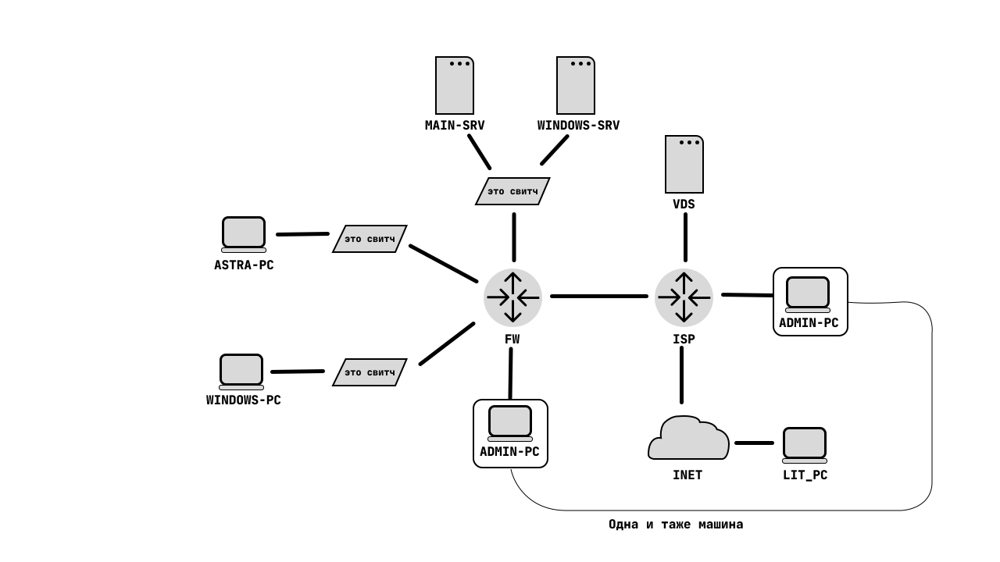

# Таблица адресации и операционных систем
| machine(int)      | OS                              | ip                           | mask | gateway    |
| ----------------- | ------------------------------- | ---------------------------- | ---- | ---------- |
| ASTRA-PC          | Astra Linux Common Edition Орёл | DHCP                         | 24   | first addr |
| WINDOWS-PC        | Windows 10 Home                 | DHCP                         | 24   | first addr |
| MAIN-SRV          | Ubuntu Server 22.04 LTS         | 3th address from 172.16.1.16 | 29   | first addr |
| WINDOWS-SRV       | Windows Server 2019             | 4th address from 172.16.1.16 | 29   | first addr |
| FW(srv net)       | Vyos                            | 1th address from 172.16.1.16 | 29   | -          |
| FW(astrapc net)   |                                 | 172.16.2.1                   | 24   | -          |
| FW(windowspc net) |                                 | 172.16.3.1                   | 24   | -          |
| FW(isp)           |                                 | 2nd from 3.14.15.92          | 30   | 1st        |
| VDS               | CentOS Stream 8                 | 2nd from 3.14.15.96          | 30   | 1st        |
| ISP(fw)           | OPNSense                        | 1st from 3.14.15.92          | 30   | inet       |
| ISP(vds)          |                                 | 1st from 3.14.15.96          | 30   | inet       |

# Common
1. Настроить hostnamы и ip-адреса в соответствии со схемой сети и таблицой адресации

# WINDOWS-SRV
1. Установить Windows  Server 2019 
2. Настроить сервер в качестве контроллера домена corp.local
3. Запретить машинам домена уход в спящий режим и отключить анимацию при входе на компьютер под новым пользователем
4. Создать в домене 100 пользователей с логинами User\*, где \*-номер пользователя с паролем Bereza\*
5. Настроить DHCP сервер для компьютера WINDOWS-PC (использовать первые 100 адресов из данной сети, DNS - MAIN-SRV)
6. Настроить WDS для установки Windows 10 Home на WINDOWS-PC

# MAIN-SRV
1. Установить Ubuntu Server 2019
2. Настроить DHCP-сервер для компьютера ASTRA-PC(использовать первые 100 адресов из данной сети, DNS - MAIN-SRV)
3. Установить DNS-сервер bind9 
4. Настроить зону corp.local и создать в ней A записи для серверов, FW и VDS, для пересылки неизвестных запросов использовать DNS-сервер на VDS
5. Создать PKI с помощью easy-rsa и распространить корневой сертификат на клиентские машины. На этом PKI создать сертификат для защиты Nextcloud
6. Настроить Nextcloud, используя Docker, база данных MariaDB(должны быть развёрнута также в docker), в качестве reverse-proxy использовать traefik 2.0, использовать сгенерированный ранее сертификат для зашиты соединений
7. Создать Ansible Playbookи для установки на клиентские компьютеры офисного пакета МойОфис Домашняя Версия
8. Установите и настройте exporterы для prometheus на VDS для мониторинга bind9, traefik
9. Админу необходимо иметь доступ к корпоративной сети с дачи, для этого поднимите ovpn сервер 
10. Настройте всё необходимое для сетевой установки Astra Linux Common Edition release Орёл на ASTRA-PC

# VDS
1. Т.к Ваш провайдер заблокировал доступ к необходимым для нормальной работы второго админа Pikabu и Reddit, Вам пришлось купить VDS заграницой и настроить на нём Wireguard VPN для получения доступа к заблокированным ресурсам
2. Настройте bind9 для зоны vds.com
3. Разверните Prometheus и Grafana, а в качестве reverse-proxy используйте haproxy, используйте доменные имена prometheus.vds.com и grafana.vds.com соответсвенно
4. Разверните Minecraft Server используя Podman и обеспечьте возможно сыграть на нём с компьютера LIT-PC(пробросьте порт на ISP)
5. Настройте rsyslog для приёма логов с роутером
6. Т.к. VDS находьтся в интернете нужно подумать о безопасности: заблокируйте доступ ко всем портам машины, кроме портов, используемых настроенными сервисами; перенесите sshd на порт 1984 и отключите доступ по паролю

# FW
1. Подключитесь к развёрнутому на VDS VPN-серверу и используйте этот канал для доступа в интернет, обеспечьте автоматическое подключение при запуске роутера
2. Пробросьте порт для ovpn сервера на MAIN-SRV
3. Настройте DHCP-relay для ASTRA-PC и WINDOWS-PC, а также DHCP-сервер для ноутбука админа
4. Разрешите обнаружение этого роутера по LLDP
5. Настроте пересылку логов на rsyslog сервер на VDS

# ISP
1. Разрешите обнаружение этого роутера по LLDP
2. Пробросьте порт для Minecraft сервера на VDS
3. Настроте пересылку логов на rsyslog сервер на VDS

# ADMIN-PC
Настройте доступ по ключу к VDS для пользователя admin на VDS с пользователя admin на этом компьютере